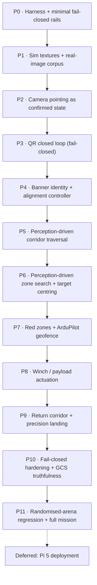

# AeroTHON 2026 Mission 2 — Phased Execution Plan

**Created:** 2026-08-15
**Basis:** `goal.md` (30 locked requirements) + `CURRENT_PROGRESS_HANDOFF.md` (honest defect list)
**Supersedes:** the "Recommended repair order" section of the handoff (reordered per user direction)

---

## 0. Ground rules agreed with the user

| Decision | Choice |
|---|---|
| **Ordering priority** | **Perception loops first** — camera pointing, QR, banner are the highest-uncertainty work |
| **Timeline** | No fixed deadline. Phases sequenced by dependency, not calendar |
| **Sim asset fidelity** | **Both** — real Gazebo textures *and* a real-photo regression corpus |
| **Definition of phase-complete** | **Full evidence pack**: automated test + live SITL run + rosbag + annotated video + written note in `VERIFICATION.md` |
| **Execution mode** | **Gate at each phase boundary** — full phase runs autonomously, then stop for go-ahead |
| **In scope** | Winch/payload actuation · Red zones + ArduPilot geofence · GCS truthfulness |
| **Deferred** | Pi 5 hardware deployment (Docker arm64, systemd, udev, serial router vs real Pixhawk, core pinning) |
| **Arena geometry** | **Fully perception-driven — no fixed waypoint constants.** Geofence-derived coarse prior exists only as a non-default fallback profile |

### Standing risk note

Fully perception-driven navigation is a materially harder autonomy problem than parameterised waypoints. Every stage transition must be earned from a sensor observation, which means every stage needs its own detector, its own confidence gate, and its own failure path. Accepted deliberately; mitigated by (a) the fallback geofence profile, (b) randomised-arena regression testing as the acceptance proof.

### Immediate housekeeping

A stale Level-6 stack is still running from the previous session (PGID `176131`). Kill it before Phase 0:

```bash
kill -TERM -- -176131
```

---

## 1. Phase map



---

## Phase 0 — Test harness and minimal fail-closed rails

**Why first:** you cannot debug perception on a state machine that reports success when it failed, and you cannot produce an evidence pack without evidence tooling. Kept deliberately small — this is not the full hardening phase (that's P10).

**Work**
- Kill the stale stack; make `scripts/launch_level6_sim.sh` idempotent (detect + reap prior PGID on start).
- Evidence tooling: `scripts/capture_evidence.sh` — starts a scoped `rosbag2` record, grabs camera + RViz + GCS frames, writes to `evidence/<phase>/<timestamp>/`.
- `VERIFICATION.md` scaffold: one append-only section per phase (claim → method → raw output → verdict).
- **Minimal rails only:**
  - No setpoint publication while disarmed outside `ARMING`.
  - `LAND` / `DISARM` / `ABORT` cancel and reset the behaviour tree to `WAITING`.
  - `/mission/result` topic with latched `{state, reason}` — no more silent stage-stalling.
  - Excessive-attitude abort (the last run sat at 54° tilt against a wall and nothing complained).
- Geometry audit: enumerate every hardcoded constant in `mission_tree.py`, tag each with which phase replaces it with a perception source. Produces `docs/GEOMETRY_AUDIT.md`.

**Acceptance**
- Tree provably returns to `WAITING` after external LAND/DISARM, asserted by a launch test.
- Attitude abort fires in a deliberately induced tilt.
- `capture_evidence.sh` produces a complete pack on a trivial run.

**Files:** `scripts/launch_level6_sim.sh`, `scripts/capture_evidence.sh`, `src/aerothon_mission/mission_bt/mission_bt/mission_tree.py`, `mav_commander.py`, `VERIFICATION.md`, `docs/GEOMETRY_AUDIT.md`

### ✅ STATUS: COMPLETE (2026-08-15) — see `VERIFICATION.md` §0

39 offline tests + **13/13 live SITL checks**. Every rail mutation-tested. Five rails shipped (the fourth and fifth were found *by* the work):

1. No setpoints to a disarmed aircraft
2. External DISARM / uncommanded LAND-RTL resets the tree to `WAITING`
3. Excessive-attitude abort with a stated reason
4. `/mission/result` latches one outcome per run as JSON
5. **Abort latches** — found live when an abort released itself and the mission resumed mid-flight

**Also delivered (unplanned, required to make the phase possible):**
- `scripts/install_ardupilot_overlay.sh` — the ArduPilot/Gazebo overlay had been built into `/tmp` and destroyed by a reboot. Now rebuilt persistently into `~/aerothon_stack`, reproducibly, without root.
- `scripts/run_tests.sh` — one-command offline suite.
- Three launch defects fixed (self-killing reaper, ArduCopter crash-looping on DDS parameters, router fed on the wrong port).
- Two test-integrity defects fixed (`mavros_msgs` mock poisoning every later test file; `preflight_stack.sh` reporting four false failures).

**Deliberately NOT fixed here — assigned onward (`VERIFICATION.md` §0.13):**
- Aircraft cannot hold a stable climb (sustained >45° tilt in takeoff) → **P2**
- Mission advances while the aircraft sits at 0.1 m altitude → **P5** / **P10**
- Telemetry rates far below spec (pose ~2 Hz, `/scan` 6.8 Hz vs Q27's ≥8 Hz) → **P2**

---

## Phase 1 — Sim asset realism + real-image regression corpus

**Why here:** every perception result from here on is only as trustworthy as what it was measured against. Currently QR pads render as untextured box geometry, so "QR detection works" has never been tested through the sim camera at all.

**Work — 1a, Gazebo textures**
- Fix the OGRE2 / PBR material path for Harmonic (`<material><pbr><metal><albedo_map>`) with correct `GZ_SIM_RESOURCE_PATH` and relative URIs; this is where the previous attempt failed.
- Real decodable QR textures on start pad + target pads (`AEROTHON2026:M2:TARGET_*`), real green `AEROTHON` banner texture with lettering (lettering matters for P4 identity validation).
- Ground-truth check: decode from the *sim camera stream* at 3 / 5 / 10 m nadir, and at 15°/30° off-axis.

**Work — 1b, real-image corpus**
- Printed QR at measured stand-offs and angles, real green banner, indoor + direct sun + overcast.
- `tests/perception/corpus/` + `pytest` regression asserting decode rate and HSV segmentation IoU against hand-labelled ground truth.
- Sim-vs-real delta report: if the sim decodes at 10 m and reality fails at 6 m, every downstream altitude assumption changes.

**Acceptance**
- Decode-rate table (distance × angle × lighting) for sim and real, both committed.
- Banner segmentation passes IoU threshold across the full lighting sweep.
- Documented **max reliable QR stand-off** — this number sets the search altitude in P6, replacing the `search_alt = 10.0` guess.

**Files:** `src/aerothon_sim/sim_gazebo/worlds/mission2.sdf`, `materials/`, `scripts/generate_competition_assets.py`, `scripts/materialize_world.py`, `tests/perception/`

**Note:** 1b needs you to physically shoot the corpus (printed QR + banner + camera). I'll specify the exact shot list; you capture, I build the harness.

---

## Phase 2 — Camera pointing as a commanded, confirmed state

**Why here:** this is the single root cause of the start-QR failure. The mission holds at 5 m and never points the camera down, so the ground QR is simply not in frame. No amount of detector tuning fixes a camera aimed at the sky.

**Added to this phase by Phase 0's live findings** (`VERIFICATION.md` §0.13) — these come *first*, because pointing a camera on an aircraft that cannot hold attitude is pointless:
- **Fix flight stability.** The vehicle sustained >45° tilt during takeoff. Prime suspect is `scripts/materialize_vehicle_model.py`, which bolts lidar and camera links onto the Iris and changes mass/inertia. Verify hover, position hold and a fixed waypoint leg before anything else.
- **Fix telemetry stream rates.** Measured live: pose ~1.5–2.8 Hz, `/scan` 6.8 Hz, `/camera/image` 4.9 Hz. `goal.md` Q27 requires LiDAR ≥ 8 Hz and Q14 requires 10 FPS for QR. Request rates explicitly via `SR*` params / `MAV_CMD_SET_MESSAGE_INTERVAL`. Every later loop's timing budget depends on this.
- **Re-run the attitude profiler** (`sim/profile_takeoff_attitude.py`) afterwards and set the attitude limit and debounce from measured data rather than the current 45°/5-sample guess.

**Work**
- Named camera poses: `FORWARD` (0°, banner + corridor), `NADIR` (−90°, start QR / search / drop / landing), `ALIGN` (intermediate for target centring).
- `camera_ctrl` node: commands the pose, **reads back `webcam_pitch_joint` state**, publishes `/camera/pose_state {requested, actual, settled, age}`.
- `settled` requires the joint within tolerance for N consecutive samples — no open-loop assumptions.
- Every perception behaviour gates on `settled == true` for its required pose; a stage that needs NADIR cannot run FORWARD.
- Add camera pose to `/mission_ready` as a per-stage precondition.
- Real-hardware path: same interface over `MAV_CMD_DO_MOUNT_CONTROL` so the sim and Pixhawk servo share one API.

**Acceptance**
- Commanded −90° confirmed at the joint within tolerance and within a bounded settle time, asserted by test.
- A perception stage requesting NADIR **blocks** (does not proceed, does not time out to success) while the joint is stuck at 0°.

**Files:** new `src/aerothon_perception/camera_ctrl/`, `mission_tree.py`, `mav_commander.py`, `aggregator.py`

---

## Phase 3 — Start-QR closed loop, fail-closed

**Work**
- Delete timeout-to-success. `ScanStartQR` outcomes are `SUCCESS(payload)` or `FAILURE(reason)` — never `SUCCESS("")`.
- Confidence gating: same payload decoded on K consecutive frames before latching.
- Altitude-aware plausibility: expected marker pixel size from altitude + intrinsics; reject decodes whose geometry is inconsistent (rejects reflections and distant false positives).
- Latch target string to `/mission/target`, published and displayed.
- **Q19 contingency:** GCS manual target injection over WebSocket, explicitly logged as operator-provided in the event stream.
- Wire `/percep/qr/target_offset` into a visual-centring servo (used properly in P6, built and unit-tested here).
- Nadir descent-and-retry ladder on failed decode instead of blind abort.

**Acceptance**
- Empty/undecodable start QR ⇒ mission does **not** advance; `/mission/result` reports the reason.
- Successful decode latches within a bounded time from the live sim camera.
- Operator injection path works and is distinguishable in the log.

**Files:** `perception_qr/qr_node.py`, `mission_tree.py`, `mav_commander.py`, `aggregator.py`, GCS `App.tsx`

---

## Phase 4 — Banner identity validation + real alignment controller

**Why here:** with no fixed geometry, the green banner *is* the corridor entrance. This phase is what replaces `corridor_entry = (5.0, 0.0, 3.0)`.

**Work**
- Upgrade `perception_banner` from "green blob" to **identity validation**: green segmentation → shape/aspect gate → lettering check (template or contour-count heuristic on the `AEROTHON` text) so a green tarpaulin isn't accepted.
- Publish `/percep/banner/pose {bearing, elevation, apparent_width, confidence, stable_frames}`.
- New `banner_align` controller: horizontal centroid error → yaw rate; apparent-width error → forward closure. Requires stability over N frames before declaring aligned.
- BT behaviour: search-yaw sweep until banner acquired → align → hold → declare corridor entry heading. Fails closed if not acquired within the sweep.
- GCS `ALIGNED` label finally means geometrically aligned, not blob-detected.

**Acceptance**
- From a random spawn yaw, drone acquires and centres the banner within pixel tolerance, repeatably.
- A decoy green rectangle is rejected by the identity gate.
- Corridor entry heading is produced entirely from perception with no waypoint constant.

**Files:** `perception_banner/banner_node.py`, new `banner_align` behaviour, `velocity_controller.py`, `mission_tree.py`

---

## Phase 5 — Perception-driven corridor traversal

**Why here:** replaces both the reactive stop-and-nudge controller and `corridor_exit_x = 15.5`.

**Work**
- Lidar corridor estimator: fit the two wall lines from `/scan`, derive centreline + heading error + corridor width. Drives forward progress along the *observed* axis.
- Obstacle handling: cluster frontal returns, measure lateral extent, **select a pass side** with the larger clearance, execute a committed lateral offset, re-centre. Not a stop-and-hope.
- Recovery behaviour: when boxed in, back off along the estimated axis and re-attempt with the opposite pass side.
- **Exit detection from perception:** wall lines terminate / corridor width opens beyond threshold ⇒ corridor complete.
- Lidar health: stale-scan failsafe, minimum valid-return count, the Q21 pre-processing filter chain (angular masking of arm sectors, 0.15–12 m clamp, statistical outlier removal).
- Maintain the Q8 0.8 m repulsive bubble as a hard constraint on commanded velocity.

**Acceptance**
- Clear corridor traversed by position/velocity control with no geometry constants.
- **Every obstacle arrangement, both directions**, no collision, across repeated runs.
- Induced lidar dropout triggers the failsafe rather than a blind fly-on.

**Files:** `src/aerothon_avoidance/avoidance/avoidance/velocity_controller.py` (substantially rewritten), new corridor estimator node, `mission_tree.py`

---

## Phase 6 — Perception-driven zone search + target centring

**Why here:** replaces `zone = (20.0, 52.0, -12.0, 12.0)` and the fixed lawnmower rectangle.

**Work**
- Zone entry recognised from perception (corridor exit + observed open area), not a waypoint.
- Climb to the **P1-derived** reliable QR altitude, not a guessed 10 m.
- Lawnmower generated at runtime from observed zone extent with lane spacing derived from camera FOV × altitude × required overlap — provably full coverage rather than a hardcoded 5 m.
- Stop-on-match against the P3 latched target string, with the same K-frame confidence gate.
- Descend + visual centring using `/percep/qr/target_offset` until within drop tolerance; re-acquire if lost during descent.
- Search exhausted without a match ⇒ explicit failure + safe return, not an infinite sweep.

**Acceptance**
- Target found and centred with the drone spawned at a randomised zone offset.
- Coverage proof: generated lane plan mathematically covers the observed extent.
- Non-matching QRs correctly ignored; wrong-target delivery impossible.

**Files:** `mission_tree.py`, new search-planner node, `perception_qr/qr_node.py`

---

## Phase 7 — Red zones and ArduPilot geofence

**Work**
- HSV red detection → **georeferenced** exclusion polygons (project detections through camera pose + altitude into the local frame), accumulated into the costmap rather than a boolean flag.
- Search planner in P6 consumes the exclusion set; lane plan re-generated to route around, with the coverage proof preserved.
- ArduPilot fence upload via MAVROS with **read-back verification**, inclusion (arena) + exclusion (red zones).
- Camera red-detection demoted to supplementary; the fence is the authoritative boundary.
- Distinguish `NOT VISIBLE` from `CLEAR` end-to-end (detector → aggregator → GCS).

**Acceptance**
- Uploaded fence read back and byte-compared.
- Search path provably excludes red polygons — asserted geometrically in test, plus a live run where a red zone sits inside the naive lane plan.
- Red-zone breach counter stays at zero across repeated runs.

**Files:** `perception_redzone/redzone_node.py`, search planner, `mav_commander.py`, `aggregator.py`, GCS

---

## Phase 8 — Winch / payload actuation

**Why here:** currently `/winch/cmd` has two publishers and zero subscribers. Nothing has ever moved.

**Work**
- Gazebo side: a winch joint / prismatic payload tether on the vehicle model with position + effort feedback.
- `winch_ctrl` node subscribing `/winch/cmd`, publishing `/winch/status {state, payout_m, current, at_limit, fault}`.
- Ground-contact detection: line-slack / current-drop trigger with an encoder payout cap (matches the locked hardware plan).
- Release gated on: position within tolerance, altitude within tolerance, hover stability over N samples, actuator healthy. Any failing ⇒ no release.
- Stow sequence with completion feedback; fault and abort handling (jam, over-payout, release-not-confirmed).
- Real-hardware path stubbed behind the same interface via `MAV_CMD_DO_WINCH`.

**Acceptance**
- Full lower → ground-detect → release → stow cycle in sim with feedback at every step.
- Release **refused** under induced instability / wrong altitude / actuator fault, each asserted separately.
- No fixed tick delays anywhere in the sequence.

**Files:** new `src/aerothon_payload/winch_ctrl/`, vehicle model, `mission_tree.py`, `aggregator.py`, GCS

---

## Phase 9 — Return corridor and precision landing

**Work**
- Reverse traversal reusing the P5 estimator at 180° yaw — no `corridor_return_exit_x` constant.
- Home approach on GPS (the one legitimate global reference), then visual fiducial alignment over the home pad at NADIR.
- Precision-land descent with continuous fiducial lock; abort-to-hover and re-acquire if lock is lost above a floor altitude.
- Touchdown confirmation and disarm.

**Acceptance**
- Return corridor cleared with the same obstacle arrangements as P5.
- Landing accuracy measured across repeated runs, reported as a distribution not a single lucky run.
- Fiducial-loss recovery demonstrated.

**Files:** `mission_tree.py`, `velocity_controller.py`, `perception_qr` (fiducial mode), `mav_commander.py`

---

## Phase 10 — Full fail-closed hardening + GCS truthfulness

**Work — state machine**
- Every transition backed by an explicit sensor or flight success condition; audit all of them against `docs/GEOMETRY_AUDIT.md`.
- Deterministic restart semantics (the py_trees memory-sequence progress-retention bug).
- Latched success/failure with reason codes, surfaced in the event stream.
- Complete the Q11 three-tier failsafe: ELRS override, companion-heartbeat watchdog → LOITER/RTL, native battery/geofence.
- Harden `/mission_ready` from 4 checks to the real Q27 interlock: GPS ≥ 12 sats, HDOP < 1.2, battery > 15.0 V, EKF healthy, lidar ≥ 8 Hz, MAVLink latency < 100 ms, TF consistency, SLAM health, detector health, camera pose, actuator health, RC failsafe state.

**Work — GCS truthfulness** (no new UI polish; just stop the panel lying)
- Real EKF health and geofence state from MAVROS diagnostics, replacing hardcoded `true` / `INSIDE`.
- Satellite count populated from GPS status.
- Checklist items mark **verified completion**, not state entry.
- Stale-data ages shown per field; unknown rendered as unknown.
- Failure reasons displayed.

**Acceptance**
- Every interlock item individually forced to fail ⇒ arming blocked, correct reason shown.
- No GCS field displays a value that isn't measured — audited field by field.
- Companion-heartbeat loss triggers LOITER/RTL within the specified window.

**Files:** `mission_tree.py`, `mav_commander.py`, `aggregator.py`, `readiness_node.py`, `App.tsx`, `types.ts`, `main.rs`

---

## Phase 11 — Randomised-arena regression and full mission

**Why this is the real proof:** if the mission is genuinely perception-driven, it survives an arena it has never seen. That is the acceptance test for the entire architecture choice.

**Work**
- World generator producing randomised valid arenas: corridor position/length/orientation, obstacle count and placement, zone position and size, red-zone placement, target pad location, spawn pose.
- Run the full 8-stage mission across N randomised arenas; any hardcoded geometry surviving anywhere will fail here loudly.
- RViz cleanup: TF names/arrows off by default with a frame whitelist, stale `camera_link` / `laser_frame` entries removed, follow-camera view, separate SLAM debug config.
- Timing profile against the Q1 5–8 minute target.
- Correct `docs/STACK_AND_DEPLOYMENT.md` (the handoff flags its claims as too optimistic) and retire `CURRENT_PROGRESS_HANDOFF.md` into the archive once its defect list is closed.

**Acceptance**
- Documented success rate across N randomised arenas, with every failure classified.
- Zero red-zone entries, zero collisions, correct target every run.
- Mission time within 5–8 minutes.
- Full evidence pack assembled as a competition-report-ready bundle.

---

## Deferred backlog (explicitly out of scope for now)

- Pi 5 arm64 Docker/Podman image, `install_pi5.sh`, systemd auto-boot, udev symlinks
- `mav_router.py` `--fcu-serial` validated against a physical Pixhawk 6X (added, never hardware-tested)
- Q24 CPU core pinning and RT priorities on the Pi
- Venue map-tile recache (currently a 1-tile radius around SITL Canberra)
- Prop-off bench tests, tethered tests, flight-envelope expansion
- Mass-budget spreadsheet, organiser clarification email

---

## Per-phase evidence pack (applies to every phase)

1. Automated test — pytest and/or ROS launch test asserting the behaviour
2. Live run in the real Gazebo + SITL + MAVROS stack on this machine
3. `rosbag2` recording of the relevant topics
4. Annotated video / screenshots (camera, RViz, GCS as applicable)
5. Written entry in `VERIFICATION.md`: claim → method → raw output → verdict

Nothing is reported as working without all five. This is the specific countermeasure against how the current state arose: 13 passing tests on a mission that times out to success.

---

## Working agreement

I execute one full phase autonomously, deliver the evidence pack, and **stop** for your go-ahead before starting the next.
